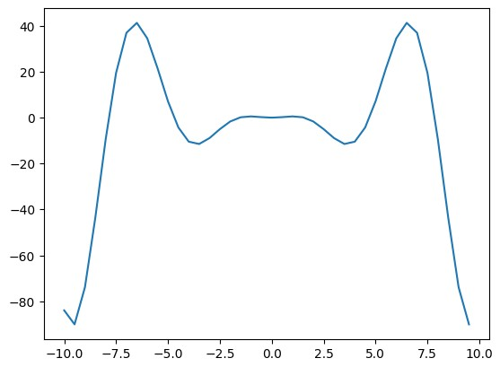
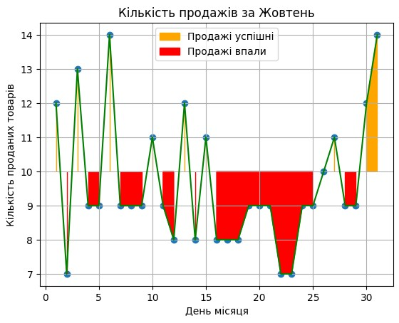
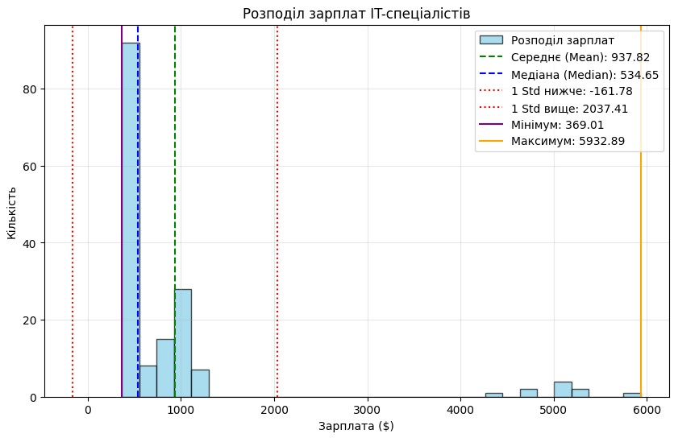
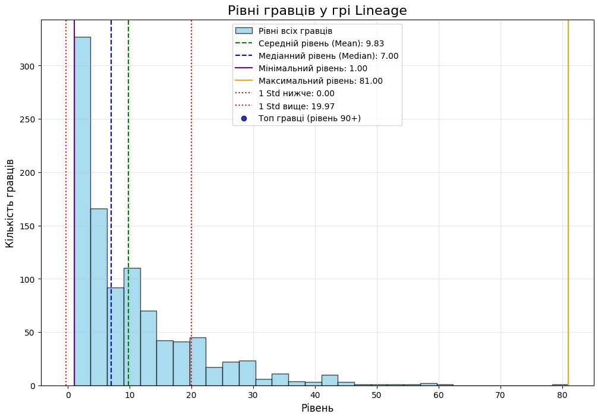

# Звіт до роботи

## Тема: Практичне застосування чисельних даних

### Мета роботи: Виконати всі завдання з двох робіт і попередніх лекційних/лабораторних занять

---

### Виконання роботи

* Результати виконання завдання:
    1. Виконано код/приклади наведені в 2_numpy_types.ipynb.
    2. Виконано код/приклади наведені в 3_numpy_operations.ipynb.
    3. Виконано код/приклади наведені в 4_numpy_statistic.ipynb.
    4. Виконано код/приклади наведені в 1.ipynb.
    5. Виконано код/приклади наведені в 2.ipynb.
    6. Виконано код/приклади наведені в 3.ipynb.
    7. Виконано код/приклади наведені в mine.ipynb.

* Приклади коду та результати виконаної роботи представлені у репозиторії в файлах Practicalappnumdata, Lecture1, Lecture2, Lecture3, Mine.

* Графіки, отримані в результаті виконання деяких із завдань:
    ```










    ```

### Висновок:
- :question: Що зроблено в роботі - Виконано всі завдання.
- :question: Чи досягнуто мети роботи - Так.
- :question: Які нові знання отримано - Те, як застосовувати чисельні дані Python на практиці.
- :question: Чи вдалося відповісти на всі питання, задані в ході роботи - Так.
- :question: Чи вдалося виконати всі завдання - Так, усі homework-и виконано.
- :question: Чи виникли складності у виконанні завдання - Ні, не виникли.
- :question: Чи подобається такий формат здачі роботи (Feedback) - Так.
- :question: Побажання для покращення (Suggestions) - Нема.

---